Getting started
===================

if you run into issues / problems please contact me email with some information, yossi@f5.com

This document explains how to begin using the F5 Reference solutions.

Full documentation for the project located here: http://f5-rs-docs.readthedocs.io/en/latest/
  

Run the rs-container
----------------------------

.. code-block:: terminal

    docker run -p 2222:22 -p 10000:8080 -it --rm f5usecases/f5-rs-container

Configure credentials and personal information
------------------------------------------------------------

log in as jenkins (root password is 'default')

jenkins user is used so that the config changes we do are available to jenkins

.. code-block:: terminal

   su root -c "su jenkins"
   
   
configure aws credentials - ONLY accesskey and secretkey. Leave the other fields as "None"

How to get aws key: https://aws.amazon.com/premiumsupport/knowledge-center/create-access-key/

.. code-block:: terminal

   aws configure

configure your personal information in the global parameters file. 

.. code-block:: terminal

   echo password > ~/.vault_pass.txt
   ansible-vault edit --vault-password-file ~/.vault_pass.txt /home/snops/f5-rs-global-vars-vault.yaml

* after you save the f5-rs-global-vars-vault.yaml file for the first time you get an error message, ignore it it's a bug
  ERROR! Unexpected Exception, this is probably a bug: [Errno 1] Operation not permitted: '/home/snops/f5-rs-global-vars-vault.yaml'

Configure jenkins and reload it
------------------------------------------------------------

the following script will configure jenkins with your information

.. code-block:: terminal

   ansible-playbook --vault-password-file ~/.vault_pass.txt /home/snops/f5-rs-jenkins/playbooks/jenkins_config.yaml

   
SSH key configuration (if you don't have an existing SSH key you want to use):
------------------------------------------------------------------------------------

use key_gen to generate a new private and public key (accept all defaults - DON'T use passphrase)

.. code-block:: terminal

   ssh-keygen
   
command will create a private/public key pair in the jenkins home directory: /var/jenkins_home/.ssh/id_rsa /var/jenkins_home/.ssh/id_rsa.pub

store both private and public key in a secure place on your laptop for future use!

Open Jenkins:
------------------------------------------------------------------------------------

on your laptop (the container host) Open Jenkins http://localhost:10000

usernmae: snops , password: default

Run your first solution:
------------------------------------------------------------------------------------

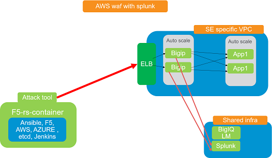
   
   
on jenkins main page, click on the folder - "aws waf with splunk"

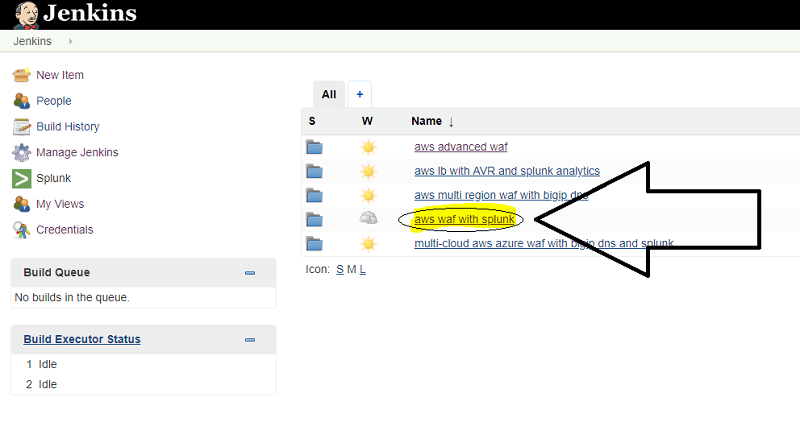

Click on the "aws waf stack 01" tab

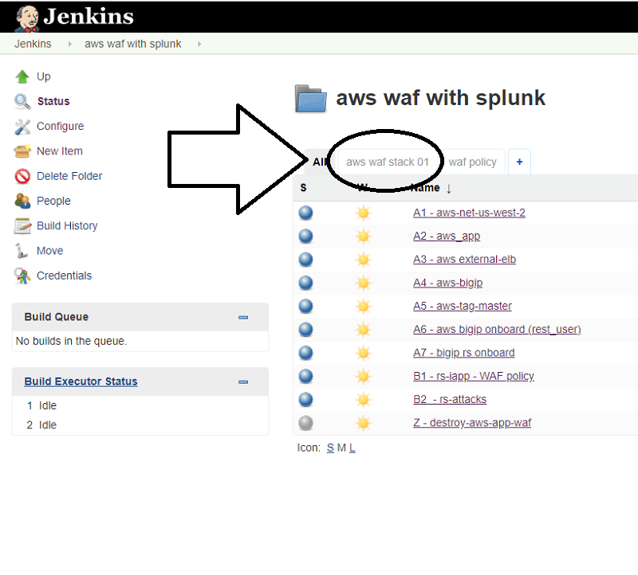

click on "run" to start the solution pipeline:

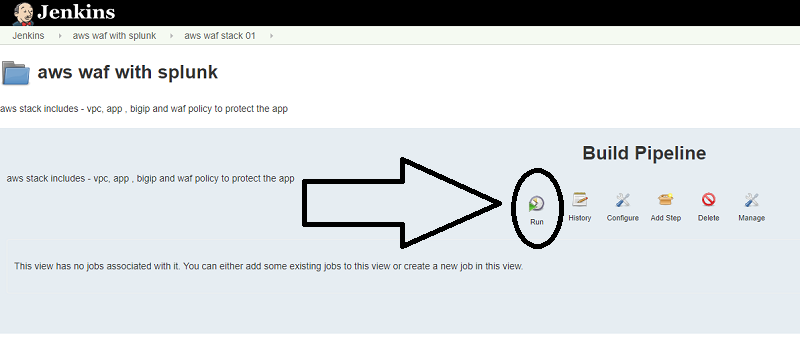

choose the region in which you want to deploy the stack and click "build":

Wait until the stack is ready (takes about 10-15 minutes). you should see all of the jobs in green. 

if one of the jobs failed, try to run in again, if it still deosn't work send me a note: yossi@f5.com

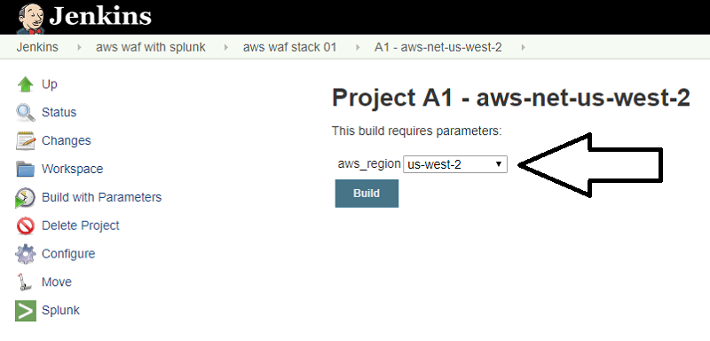
   
   
BIGIP access:
~~~~~~~~~~~~~~

click on "console output" in the "aws tag master" job 

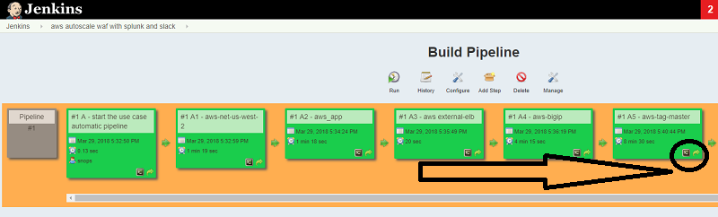

look for "bigip management" in the output

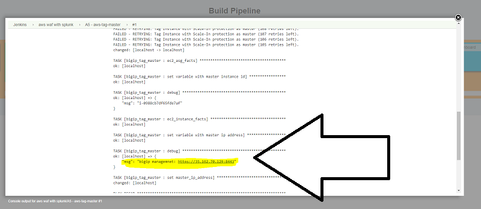

Application access:
~~~~~~~~~~~~~~~~~~~

click on "console output" in the "rs attacks" job , look for the https link to the app and verify that the attack was rejected by ASM 

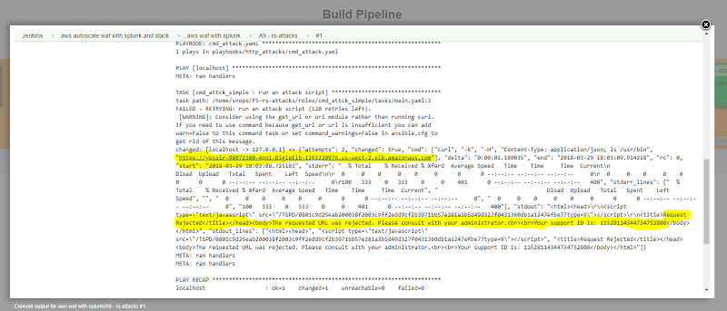

App securirty lifecycle - Proactive bot defense :
~~~~~~~~~~~~~~~~~~~

Here you will change the application security policy using jenkins, this ilustrates a process in which the sec admin creates some templates for the app teams to consume

Go back to the "aws with splunk" folder, click on the "waf policy" tab:

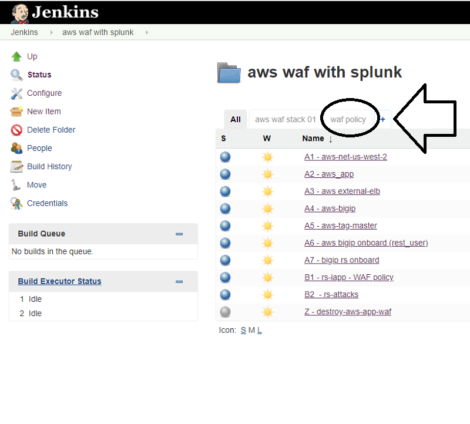

Click on "run":

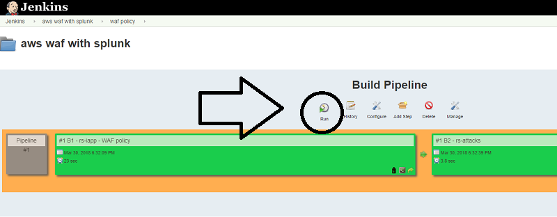

Change the setting for 'proactive bot' to "always':

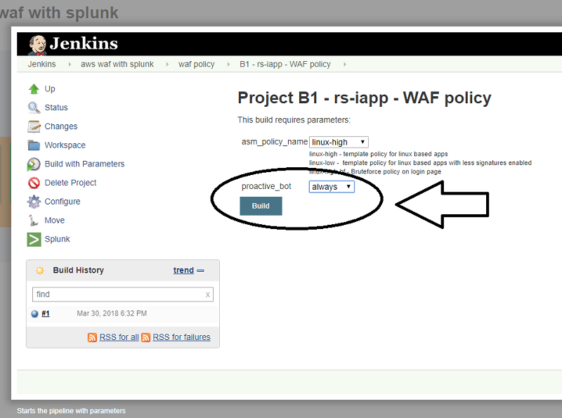

check that proactive bot defense is on by trying to access the application using curl / postman / browser with spoofed UA  

App securirty lifecycle - Brute-force protection :
~~~~~~~~~~~~~~~~~~~

Go back to the "aws with splunk" folder, click on the "waf policy" tab:

Click on "run":

Change the setting for 'asm_policy' to "linux-high-bf':

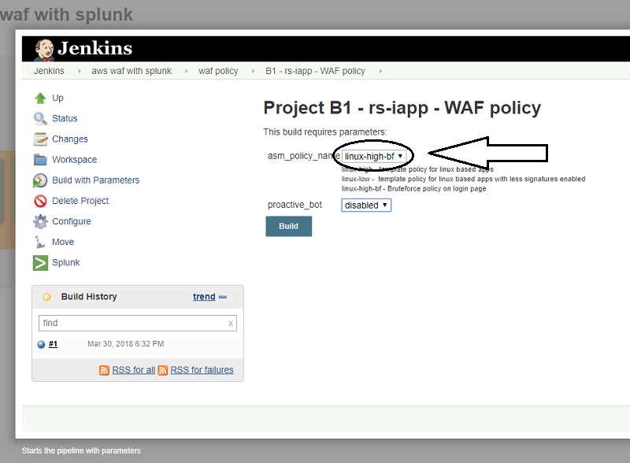
   

Verify Bruteforce is working by trying to enter wrong crednetials. 

first access the login page https://app-url/user/login 10 times to qualify the url.

after 3 failures you sohuld get a captcha page 

solve the captcha and after 3 more failures you will get the honeypot page:

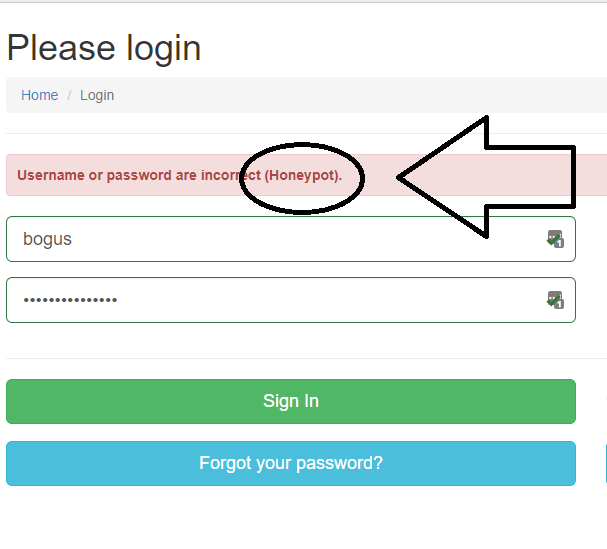

logs and analytics:
~~~~~~~~~~~~~~~~~~~

logs and analytic are sent to splunk.

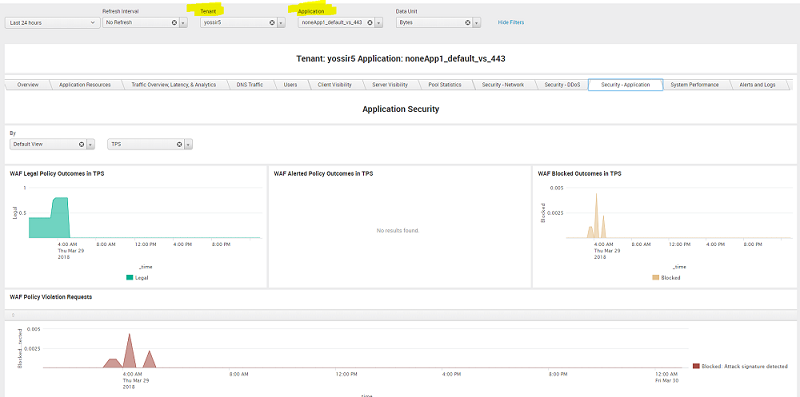
   
   
Get updates on slack:
------------------------------------------------------------------------------------

updates from the builds are getting sent to slack, you can view them in the following workspace/channel:

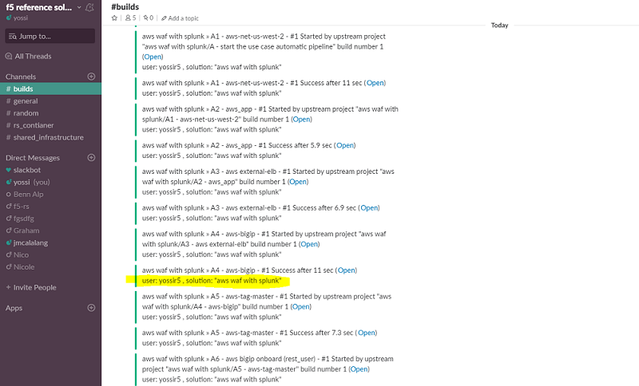

Don't forget to destory when finished:

build	"Z - destroy-aws-app-waf"

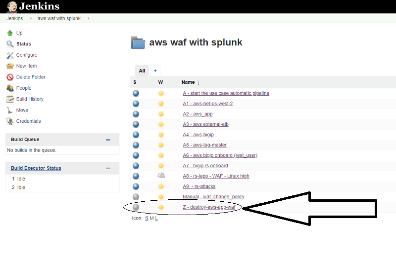

   
   

.. |run_rs_container| raw:: html

   <a href="https://hub.docker.com/r/f5usecases/f5-rs-container/" target="_blank">Docker hub page</a>

.. |install_ansible| raw:: html

   <a href="http://docs.ansible.com/ansible/latest/intro_installation.html" target="_blank">http://docs.ansible.com/ansible/latest/intro_installation.html</a>

.. |rs_video| raw:: html

   <a href="https://gitswarm.f5net.com/f5-reference-solutions/f5-rs-docs/blob/master/img/rs-video.mp4" target="_blank">quickstart video</a> 
