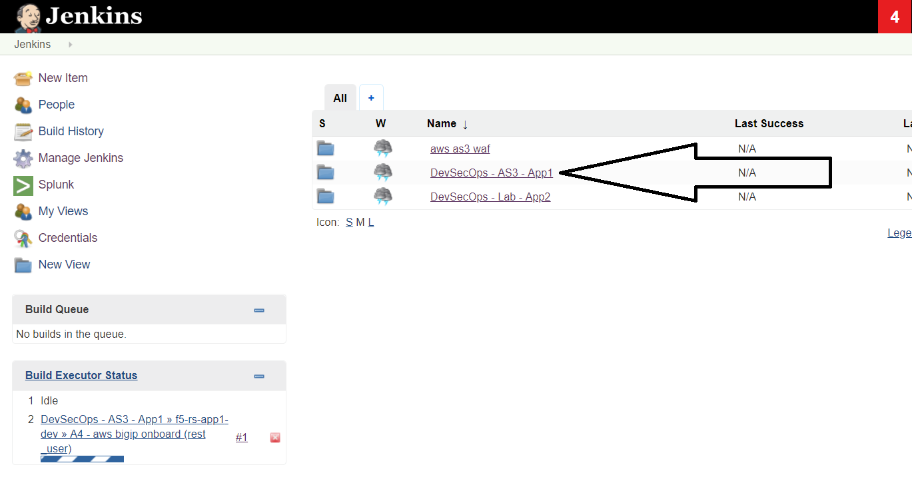
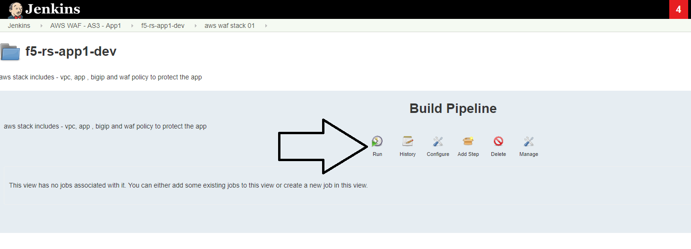
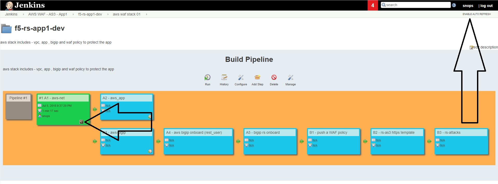
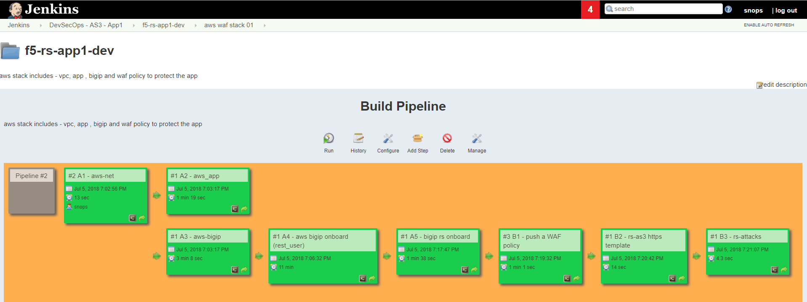
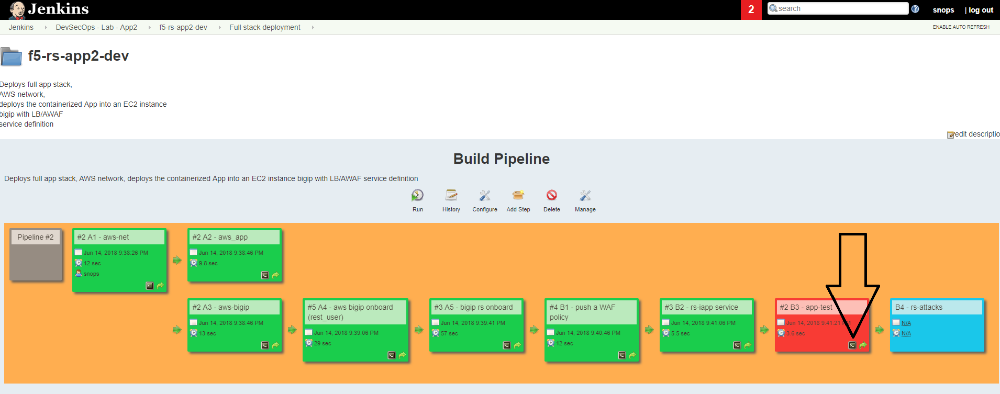
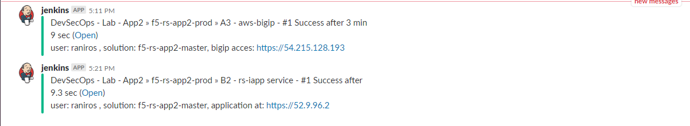

Lab 1: Deploy app to DEV environment 
----------------------------------

Background: 
~~~~~~~~~~~~~

Security team has created some security policies templates, those were built based on the F5 templates with some modifications to the specific enterprise. 
in this lab we don't cover the 'how to' of the security templates. we focus on the operational side and the workflows. 

The Tasks are split between the two roles:
 - secops
 - Dave - the person who's responsible of changing code for the app and the infrastructure of the app (dev team)
 

Task 1.1 - review Dave's repo
~~~~~~~~~~~~~~~~~~~~~~~~~~~~~~~~

1.1.1 view git branches in the application repo:
****************************************************

on the container CLI type the following command to view git branches:

.. code-block:: terminal

   cd /home/snops/f5-rs-app1
   git branch
   
the app repo has two branches, dev and master. we are now working on the dev branch. 

.. Note:: the lab builds two environments, dev and prod. 
   the dev environment deploys the code on the dev branch 
   the prod environment deploys the code on the master branch.

1.1.2 view files in the application repo:
****************************************************

on the container CLI type the following commands to view the files in the repo:

.. code-block:: terminal

   cd /home/snops/f5-rs-app1
   ls

- application code under the 'all-in-one-hackazon' folder. 
- infrastructure code maintained in the 'iac_parameters.yaml' file. 
 
1.1.3 explore the infrastructure as code parameters file:
*****************************************************************

.. code-block:: terminal

   more iac_parameters.yaml
   
the infrastructure of the environments is deployed using ansible playbooks that were built by devops/netops. 
those playbooks are being controlled by jenkins which takes the iac_parameters.yaml file and uses it as parameters for the playbooks. 

- Choose the AWS region you want to deploy in 
- Dave can also control the deployment of the security policies from his repo as we will see. 

Task 1.2 - Update the AWS region for the DEV environment (Optional)
~~~~~~~~~~~~~~~~~~~~~~~~~~~~~~~~~~~~~~~~~~~~~~~~~~~~~~~~

1.2.1 Update git with your information:
**************************
Configure your information in git, this information is used by git (in this lab we use local git so it only has local meaning) 
- on the RS-CONTAINER CLI 

.. code-block:: terminal

   git config --global user.email "you@example.com"
   git config --global user.name "Your Name"
   
1.2.2 verify you edit the dev branch:
************************** 
- go to the container CLI
- go to the application git folder (command below) 
- check which branches are there and what is the active branch. (command below) 
- you should be on the 'dev' branch. the files you see belong to the dev branch. 

.. code-block:: terminal

   cd /home/snops/f5-rs-app1
   git branch
   
1.2.3 Update the infrastructure as code parameters file:
************************** 
 
edit the iac_parameters.yaml file to the desired AWS region. then add the file to git and commit.

 - change line: aws_region: "us-west-1"
 - to: aws_region: "your_region" 

.. code-block:: terminal

   vi iac_parameters.yaml 
   git add iac_parameters.yaml
   git commit -m "changed asm policy"
   

 
Task 1.3 - Deploy dev environment 
~~~~~~~~~~~~~~~~~~~~~~~~~~~~~~~~

.. Note:: Jenkins can be configured to run the dev pipeline based on a commit in dave's app repo. 
   in this lab we are manually starting the Full stack pipeline in Jenkins to visualize the process. 

1.3.1 Open Jenkins:
**************************

- UDF: on the :guilabel:`jumphost` click on :guilabel:`access` and :guilabel:`jenkins`
- LOCAlL: open http://localhost:10000 
- :guilabel:`username:` ``snops`` , :guilabel:`password:` ``default``

.. Note:: when you open jenkins you should see some jobs that have started running automatically, jobs that contain: 'Push a WAF policy',
          this happens because jenkins monitors the repo and start the jobs.
		  *you can cancel the jobs or let them fail*. 

1.3.2 start the 'Full stack pipeline':
**************************		  
in jenkins open the :guilabel:`DevSecOps - AS3 - App1` folder, the lab jobs are all in this folder 
we will start by deploying a DEV environment, you will start a pipeline that creates a full environment in AWS. 

   |jenkins010|
   
- click on the 'f5-rs-app1-dev' folder. here you can see all of the relevant jenkins jobs for the dev environment.

   |jenkins020|

- click on :guilabel:`aws waf stack 01` tab , that's the pipeline view for the same folder. 

   |jenkins030|
   
- click on 'run' to start the dev environment pipeline. 

   |jenkins040|

   
Task 1.4 - Review the deployed environment 
~~~~~~~~~~~~~~~~~~~~~~~~~~~~~~~~

1.4.1 review jobs output:
**************************	

you can review the output of each job while its running, click on the small :guilabel:`console output` icon as shown in the screenshot:

   |jenkins050|
   
1.4.2 let the jobs run until the pipeline finishes:
**************************	
   
wait until all of the jobs have finished (turned green). 

   |jenkins055|

1.4.3 open slack and extract BIG-IP and application info:
**************************	
   
 - open slack - https://f5-rs.slack.com/messages/C9WLUB89F/ (if you don't already have an account you can set it up with an F5 email)
 - go to the :guilabel:`builds` channel. 
 - use the search box on the upper right corner and filter by your username (student#). 
 - jenkins will send to this channel the BIG-IP and the application address. 

   |slack040|

1.4.4 login to the BIG-IP:
**************************	

- use the address from the slack notification (look for your username in the :guilabel:`builds` channel)
- username: :guilabel:`admin`
- password: the personal password you defined in the global parameters file in the vault_dac_password parameter.

explore the objects that were created: 

1.4.5 Access the App:
**************************	

try to access the app using the ip provided in the slack channel - that's the Elastic ip address that's tied to the VIP on the BIG-IP.
after ignoring the ssl error (because the certificate isn't valid for the domain) you should get to the Hackazone mainpage

   |hackazone010|
    

Task 1.5 - Go over the test results 
~~~~~~~~~~~~~~~~~~~~~~~~~~~~~~~~~~~~
 

1.5.1 identify the WAF blocked page response:
**************************	
   
- Open :guilabel:`console output` on the :guilabel:`B3 - rs-attacks` job. 
- Scroll to the bottom of the page, you should see the response with :guilabel:`request rejected`, 
- Look for the ASM support-id of that request 

   
   

   
.. |jenkins020| image:: images/jenkins020.PNG 
   
.. |jenkins030| image:: images/jenkins030.PNG
   

   

   

   

   
.. |hackazone010| image:: images/hackazone010.PNG
