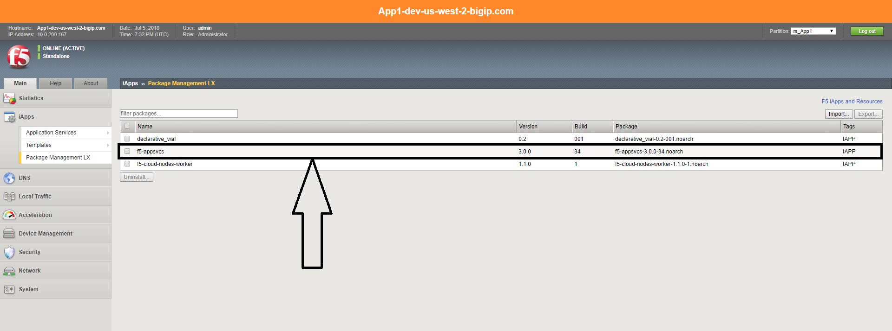
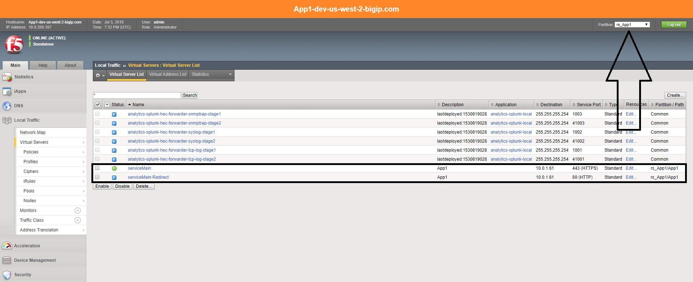

Lab 2 (BIGIP):
----------------------------
 
Task 2.1 - Open BIGIP and review configuration items 
~~~~~~~~~~~~~~~~~~~~~~~~~~~~~~~~~~~~~~~~~~~~~~~~~~~~~

2.1.1 AS3 package:
**************************	
- This lab uses AS3 as the service deceleration mechanism. 
- To use AS3 we need to install an icontrolLX package
- Navigate to :guilabel:`iApps` , :guilabel:`Package Management LX` and verify that the AS3 package is installed. 

	|Bigip-005|

2.1.2 Result of the deceleration :
**************************	

- AS3 deploys a single deceleration into a single partition. 
- Open the BIGIP and switch to the :guilabel:`rs_App1` partition 
- open the :guilabel:`Virtual Servers` tab 
- Look for the Virtual servers that were created by AS3 in the rs_App1 partition. 
- You can view the actual deceleration (json file) that was sent to the bigip by:
- Opening the :guilabel:`Console output` of the :guilabel:`B2 -rs-as3` job 
- Search for the task :guilabel:`TASK [as3_declare : deploying AS3 service]`
- The deceleration starts after :guilabel:`"body":` 
   
	|Bigip-020|
   

   

   

   
