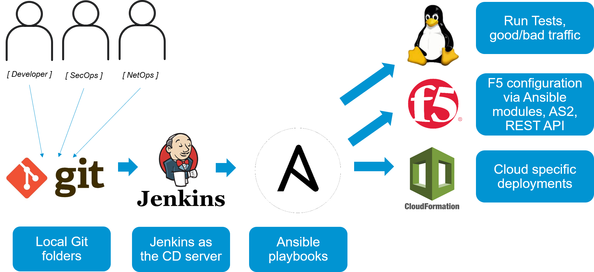

Lab  Environment
~~~~~~~~~~~~~~~~~

Lab Environment
---------------

this lab is intended to represent an app team that deploys their app on their own AWS VPC. while most of the components are dedicated for their app and separated from the rest of the netwrok, there are some services that the enterprise provides to this app team which are shared and are pre-built: 

- Centralized logging server - Splunk server 
- Bigiq License manager to license the bigips
- slack account 

The application lab environment will be built in AWS, we are going to create two environments - DEV and PROD
both environments have the exact same topology. 
in each environment we are deploying:

-  VPC with subnets, security groups and Internet gateway. 
-  1 x F5 BIG-IP VE (latest cloud version)
-  An autoscale group of application servers running DOCKER with a dockerized Hackazone app running on them. 

	|lab-diag-010|

Automation workflow
---------------

This lab leverages several automation tools, 
one of the automation guidelines is to use F5 supported solutions where possible, 

- AWS cloud formation templates are used to deploy resources into AWS (network, app, BIGIP) 
  + for more information on CFT , https://aws.amazon.com/cloudformation/
  + F5 supported CFT's , https://github.com/F5Networks/f5-aws-cloudformation 
- Ansible modules are used to contorl BIGIP configuration (Profiles, waf policy upload, iApp) 
  + more info on F5 supported ansible modules http://clouddocs.f5.com/products/orchestration/ansible/devel/ 
- F5 REST API calls are used when no ansible module is available (for example, update a DOSL7 profile) 
  + more info on F5 iControl REST, https://devcentral.f5.com/Wiki/Default.aspx?Page=HomePage&NS=iControlREST
- Jenkins is used to create a full pipeline that ties several ansible playbooks together. 
  + Each Jenkins job correlates to one ansible playbook/Role 
  + Jenkins is also used for ops notifications (Slack)
- Git is used as the SCM
  + All references in the lab itself are to the local copy of the repos that is on /home/snops/

	|automation-workflow-010|
	
Accessing the lab
----------------

The lab is built from code, to run it you need a docker host (can be your laptop), and an AWS account with API access (access and secret keys):

.. toctree::
   :maxdepth: 1
   :glob:

   udf
   local

   
.. |lab-diag-010| image:: images/lab-diag-010.PNG
