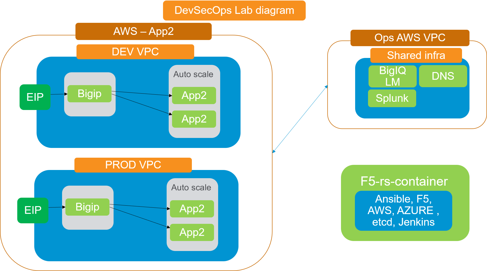

Lab  Environment
~~~~~~~~~~~~~~~~~

Lab Environment
---------------

this lab is intended to represent an app team that deploys their app on their own AWS VPC. while most of the components are dedicated for their app and separated from the rest of the netwrok, there are some services that the enterprise provides to this app team which are shared and are pre-built: 

- Centralized logging server - Splunk server 
- Bigiq License manager to license the bigips
- slack account 

The application lab environment will be built in AWS, we are going to create two environments - DEV and PROD
both environments have the exact same topology. 
in each environment we are deploying:

-  VPC with subnets, security groups and Internet gateway. 
-  1 x F5 BIG-IP VE (latest cloud version)
-  An autoscale group of application servers running DOCKER with a dockerized Hackazone app running on them. 

	|lab-diag-010|

Accessing the lab
----------------

The lab is built from code, to run it you need a docker host (can be your laptop), and an AWS account with API access (access and secret keys):

.. toctree::
   :maxdepth: 1
   :glob:

   udf
   local

   
