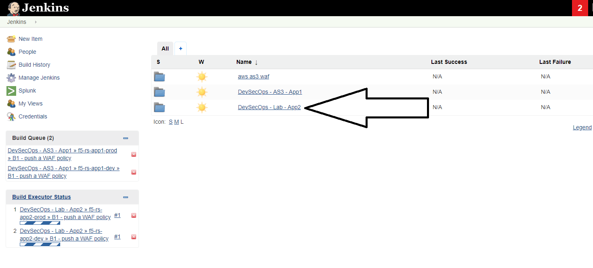
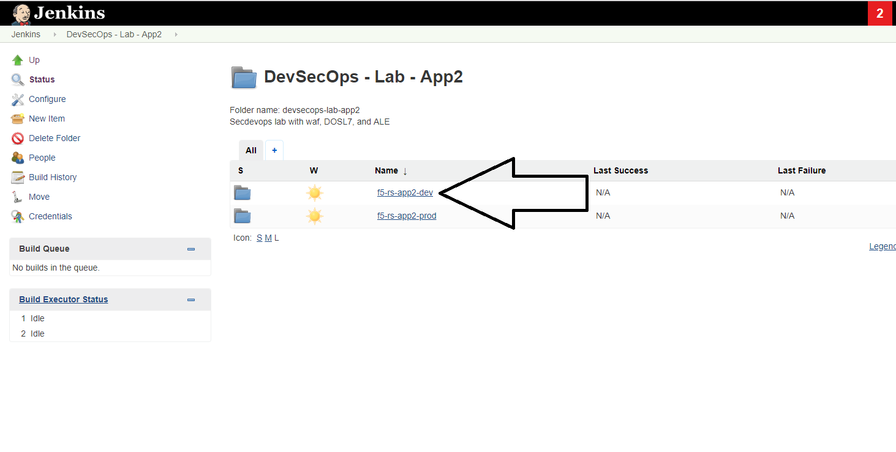
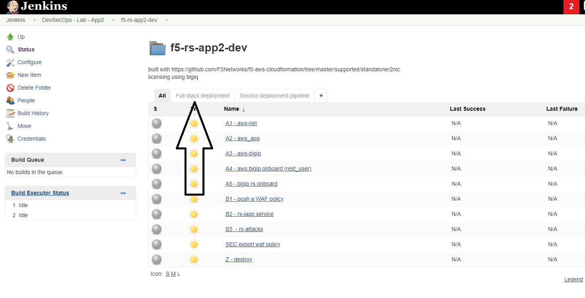
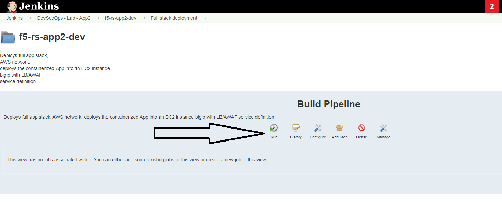
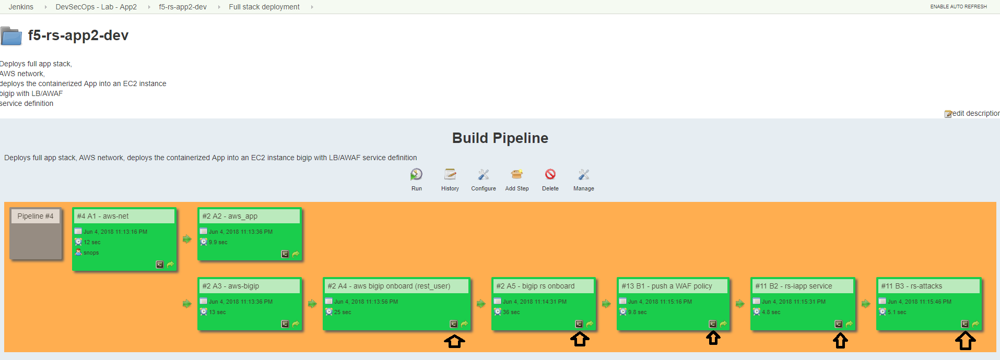
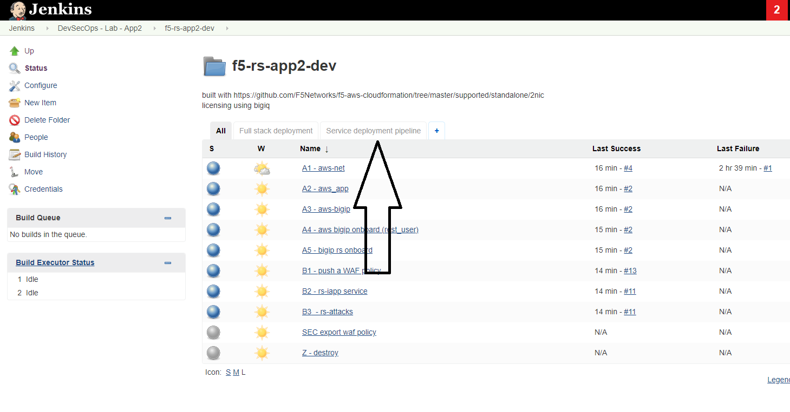
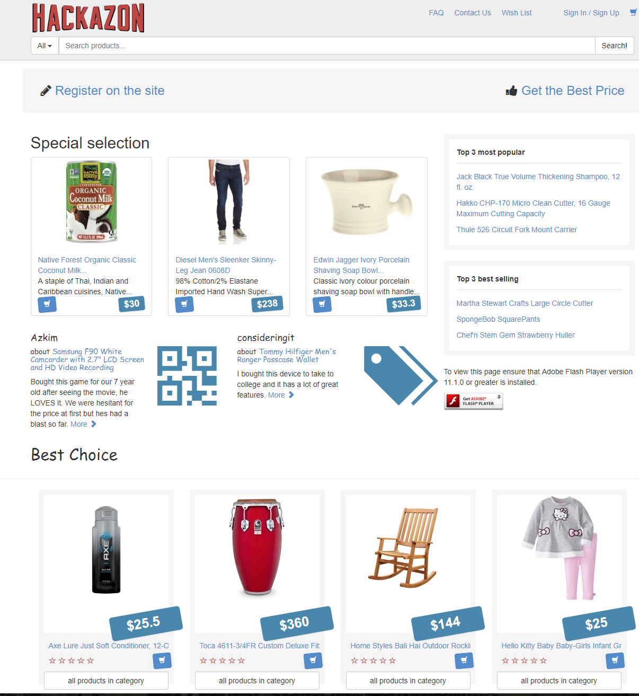

Lab 1 (Dave): Deploy app to DEV environment 
----------------------------------

Background: 
~~~~~~~~~~~~~

Security team has created some security policies templates, those were built based on the F5 templates with some modifications to the specific enterprise. 
in this lab we don't cover the 'how to' of the security templates. we focus on the operational side and the workflows. 

The Tasks are split between the two roles:
 - secops
 - Dave - the person who's responsible of changing code for the app and the infrastructure of the app (dev team)
 
Lab scenario:
~~~~~~~~~~~~~

New app - App2 is being developed. the app is an e-commerce site. 
code is ready to go into 'DEV' environment. for lab simplicity there are only two environments - DEV and PROD. 
Dave should deploy their new code into a DEV environment that is exactly the same as the production environment. 
run their application tests and security tests.

.. Note:: Pipeline is broken to DEV and PROD for lab simplicity. 
   from a workflow perspective the pipeline are the same. 
   it is broken up to two for better lab flow. 

   
.. Out of scope:: a major part of the app build process is out of scope for this lab, 
   Building the app code and publish it as a container to the registry. this process is done using DOCKERHUB.  

   
Dave repo:
~~~~~~~~~~~

explore dave's repo, that's the app2 repo. 
on the container CLI, 

.. code-block:: terminal

   cd /home/snops/f5-rs-app2
   ls

 - application code under the 'all-in-one-hackazon' folder. 
 - infrastructure code maintained in the 'iac_parameters.yaml' file. 
 
explore the file parameters:

.. code-block:: terminal

   more iac_parameters.yaml
   
the infrastructure of the environments is built using ansible playbooks that were built by devops/netops. 
those playbooks are being controlled by jenkins which takes the iac_parameters.yaml file and uses it as parameters for the playbooks. 
that enables dave to choose the aws region in which to deploy, the name of the app and more.  
 
dave can also control the deployment of the security policies from his repo as we will see. 
 
Task 1 - Deploy dev environment 
~~~~~~~~~~~~~~~~~~~~~~~~~~~~~~~~

.. Note:: Jenkins can be configured to run the dev pipeline based on code change in dave's app repo. 
   in this lab we are manually starting the AWS pipeline in Jenkins to visualize the process. 

Open Jenkins:
~~~~~~~~~~~~~~~~~~~~~~~~~

go to UDF, on the :guilabel:`jumphost` click on :guilabel: 'access' and :guilabel: 'jenkins'

usernmae: snops , password: default

when you open jenkins you should see some jobs that have started running automatically, jobs that contain: 'Push a WAF policy',
this happens because jenkins monitors the repo and start the jobs. *you can cancel the jobs or let them fail*. 

in jenkins open the :guilabel: `DevSecOps - Lab - App2` folder, the lab jobs are all in this folder 
we will start by deploying a DEV environment, you will start a pipeline that creates a full environment in AWS. 

   |jenkins010|
   
click on the 'f5-rs-app2-dev' folder.
here you can see all of the relevant jenkins jobs for the dev environment.

   |jenkins020|

click on 'Full stack deployment' , that's the pipeline view for the same folder. 

   |jenkins030|
   
click on 'run' to start the dev environment pipeline. 

   |jenkins040|

   
Task 2 - Review the deployed environment 
~~~~~~~~~~~~~~~~~~~~~~~~~~~~~~~~

   
you can review the output of each job while its running, click on the small :guilabel: `console output` icon as shown in the screenshot:

   |jenkins050|
   
   
wait until all of the jobs have finished (turned green and got to the ). 

   |jenkins060|

open slack - https://f5-rs.slack.com/messages/C9WLUB89F/
go to the 'builds' channel. 
use the search box on the upper right corner and filter by your username (student#). 
jenkins will send to this channel the bigip and the application address. 

   |jenkins070|

open the bigip and login using the provided credentials. 
explore the objects that were created: 

Cloud formation template:
~~~~~~~~~~~~~~~~~~~~~~~~~
this is the base deployment of the bigip, we start with the F5 supported 2nic CFT. 
it deploys bigip with the latest cloud version, installs the necessary cloudlibs and cloud related scripts.

bigip rs onboard:
~~~~~~~~~~~~~~~~~
deploys the 'enterprise' default profiles, for example: 
HTTP, analytics, AVR, DOSL7, iapps etc. 

push a waf policy:
~~~~~~~~~~~~~~~~~
pushes a waf policy from the repo to the bigip, updates DOSL7 and FPS profiles. 

rs-iapp service:
~~~~~~~~~~~~~~~~~
deploys a service on the bigip using either AS2 or AS3 

rs-attacks:
~~~~~~~~~~~~~~~~~
good and bad traffic generation to the app.

try to access the app using the ip provided in the slack channel - that's the Elastic ip address that's tied to the VIP on the bigip. 
after ignoring the ssl error (because the certificate isn't valid for the domain) you should get to the Hackazone mainpage

   |hackazone010|

Task 3 - Go over the test results 
~~~~~~~~~~~~~~~~~~~~~~~~~~~~~~~~~~~~

future work - review the failed tests and report them.
   
   

   

   

   

   
.. |jenkins050| image:: images/jenkins050.PNG
   

   

   

