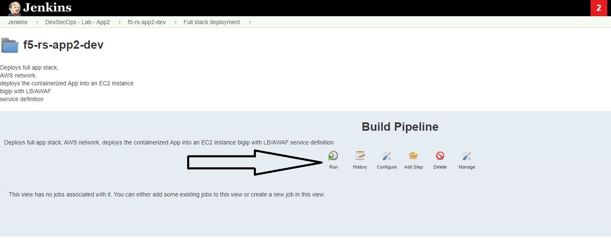
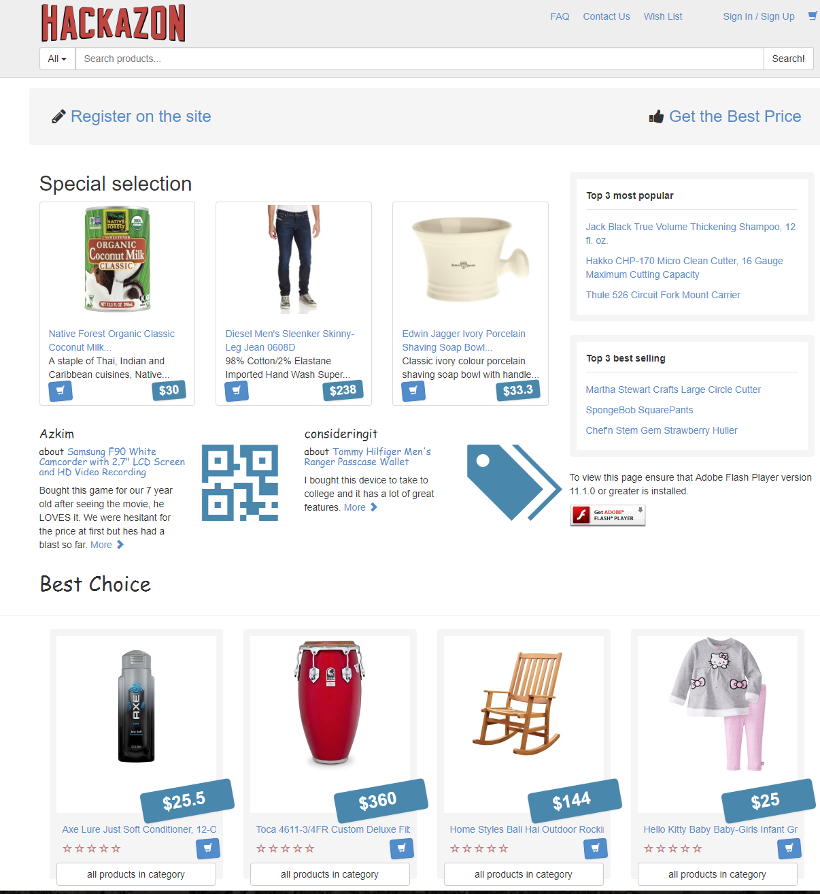

Lab 1: (Dave) protect the app from automated attacks 
----------------------------------

Background: 
~~~~~~~~~~~~~

after the app was launched we started identifying an abnormal activity, some specific products were added to the cart until the stock was out but were never purchased. in addition we identified an abuse of our coupons that every new member gets. 

in an effort to mitigate those unwanted requests the secops engineer suggests the use of 'proactive bot defense', he configures a template DOSL7 profile with some values as defaults. 
 
he then exposes the option of enabling / disabling proactive bot defense from the 'iac_paramaters' file. 

it is up to Dave now to deploy the new feature in dev and promote to PROD when it makes sense for him. 
 
Task 1.1 - Enable proactive bot defense in the DEV environment 
~~~~~~~~~~~~~~~~~~~~~~~~~~~~~~~~~~~~~~~~~~~~~~~~~~~~~~~~~~~~~~

1.1.1 Review iac_paramaters file in the app repo:
****************************************************

- Open the container CLI
- make sure you are connected as user 'jenkins' 
- go to the application git folder. 
- check which branches are there and what is the active branch. (git branch) 
- you should be on the 'dev' branch. the files you see belong to the dev branch. 

.. code-block:: terminal

   cd /home/snops/f5-rs-app2
   git checkout dev
   git branch
   
1.1.2 Edit the iac_paramaters file in the app repo:
****************************************************
 
- edit the iac_parameters.yaml file to enable proactive bot defense, 
- change the setting from: 'proactive_autometed_attack_prevention: "disabled"' 'proactive_autometed_attack_prevention: "always"'

.. code-block:: terminal

   vi iac_parameters.yaml 

1.1.3 Add the file to git and commit:
****************************************************  
- add the file to git and commit 

.. code-block:: terminal

   git add iac_parameters.yaml
   git commit -m "enabled proactive bot defense"

1.1.4 View the automatic pipeline:
**************************************************** 
   
- go back to jenkins and open the :guilabel:`f5-rs-app2-dev` folder. choose the :guilabel:`Service deployment pipeline` tab, 
  jenkins is set up to monitor the application repo. when a 'commit' is identified jenkins will start an automatic pipeline to deploy the service. it takes up to a minute for jenkins to start the pipeline. 
  jenkins takes the parametes from the git repo and uses them to deploy/update the service. 

- OPTIONAL - Log on to splunk (logon details in the UDF documentation), navigate to your app and look under the 'Security - DDoS' tab for proactive mitigation. 

Task 1.2 - (Secops) Verify bot defense configuration and logs on the BIGIP 
~~~~~~~~~~~~~~~~~~~~~~~~~~~~~~~~~~~~~~~~~~~~~~~~~~~~~~~~~~~~~~

while all of the logs are sent to splunk where they can be viewed by Dave, part of the lab is to verify the change on the BIGIP. 
this task doesn't represents an actual step of the deployment. it is just for lab purpose 
log on to the dev bigip again, check the setting on the dos profile named rs_dosl7, verify that proactive bot defense is now enabled.

	|pbd-bigip-010|
   
on the bigip, check the bot request log, verify that requests are being challenged

	|pbd-bigip-020|

this concludes the tests in the 'DEV' environment. we are now ready to push the changes to production. 

Task 1.3 - Enable proactive bot defense in the PROD environment 
~~~~~~~~~~~~~~~~~~~~~~~~~~~~~~~~~~~~~~~~~~~~~~~~~~~~~~~~~~~~~~

we will 'merge' the app2 dev branch with the master branch so that the production deployment will use the correct policy. 

1.3.1 Merge app2 dev to master :
**************************************************** 

on the /home/snops/f5-rs-app2 folder:

.. code-block:: terminal
 
   git checkout master
   git merge dev -m "enabled proactive bot defense"

1.3.2 view the automatic pipeline :
****************************************************    

the merge will trigger a job in Jenkins that's configured to monitor this repo - :guilabel:`Push WAF policy`, open the :guilabel:`f5-rs-app2-prd` folder and navigate to the :guilabel:`Service deployment pipeline` , you should see the jobs running in up to a minute.  

open the PRODUCTION bigip, check that the DOSL7 profile named rs_dosl7 has the 'proactive bot defense' enabled. 

check that requests are getting challenged in the bot event log. 

   
   
.. |pbd-bigip-010| image:: images/pbd-bigip-010.PNG 
   

   
.. |ale-bigip-010| image:: images/ale-bigip-010.PNG
   

   

   
.. |jenkins060| image:: images/jenkins060.PNG
   
.. |jenkins070| image:: images/jenkins070.PNG
   

