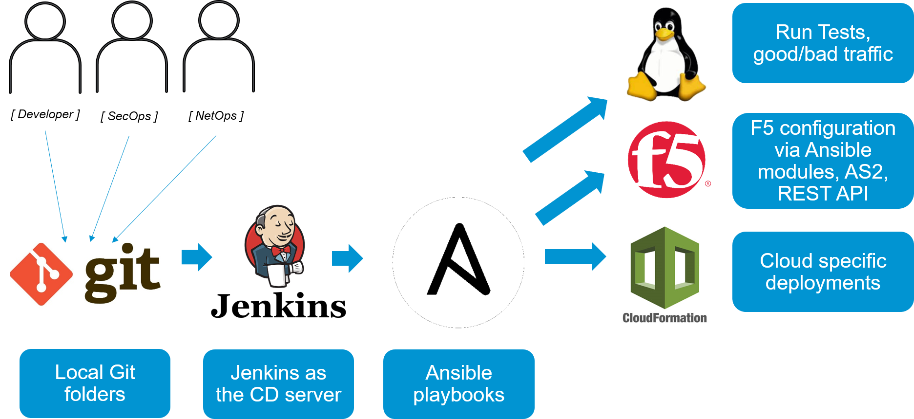

F5 reference solutions as code 
~~~~~~~~~~~~~~~~~

General
---------------

This project is a community driven effort to enable F5 users to build/experiment/test F5 services in their own cloud environments. 
The intent is to make it easier and faster to test the advanced security/ADC services offered by F5 by delivering modular pieces of automation code/scripts. 

About the framework
-------------------
The f5-rs framework is built from the following components: 

 - F5-rs-container
  - runs the tools we use and their dependencies (for example - f5-sdk, aws python sdk.. )
  
 - Shared infrastructure 
  - bigiq for licensing 
  - DNS
  - Centralized logging platform 
  
 - automation modules

    |lab-diag-005|
	
	
Tools 
----------------
The framework leverages several automation tools, 
one of the automation guidelines is to use F5 supported solutions where possible, 

- AWS cloud formation templates are used to deploy resources into AWS (network, app, BIGIP) 
 - for more information on CFT , https://aws.amazon.com/cloudformation/
 - F5 supported CFT's , https://github.com/F5Networks/f5-aws-cloudformation 
- Ansible modules are used to control BIGIP configuration (Profiles, waf policy upload, iApp) 
 - more info on F5 supported ansible modules http://clouddocs.f5.com/products/orchestration/ansible/devel/ 
- F5 REST API calls are used when no ansible module is available (for example, update a DOSL7 profile) 
 - more info on F5 iControl REST, https://devcentral.f5.com/Wiki/Default.aspx?Page=HomePage&NS=iControlREST
- Jenkins is used to create a full pipeline that ties several ansible playbooks together. 
 - Each Jenkins job correlates to one ansible playbook/Role 
 - Jenkins is also used for ops notifications (Slack)
- Git is used as the SCM
 - All references in the lab itself are to the local copy of the repos that is on /home/snops/

	|automation-workflow-010|
	
Getting started
----------------

You can run the container from any docker host, follow the instructions here:

.. toctree::
   :maxdepth: 1
   :glob:

   udf
   local

.. |lab-diag-010| image:: images/lab-diag-010.PNG
